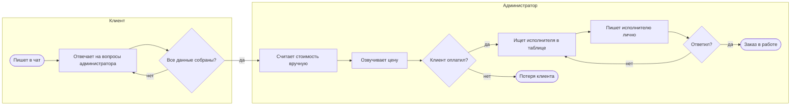
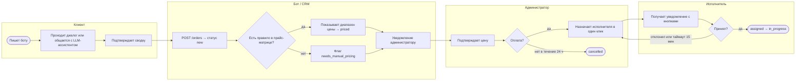
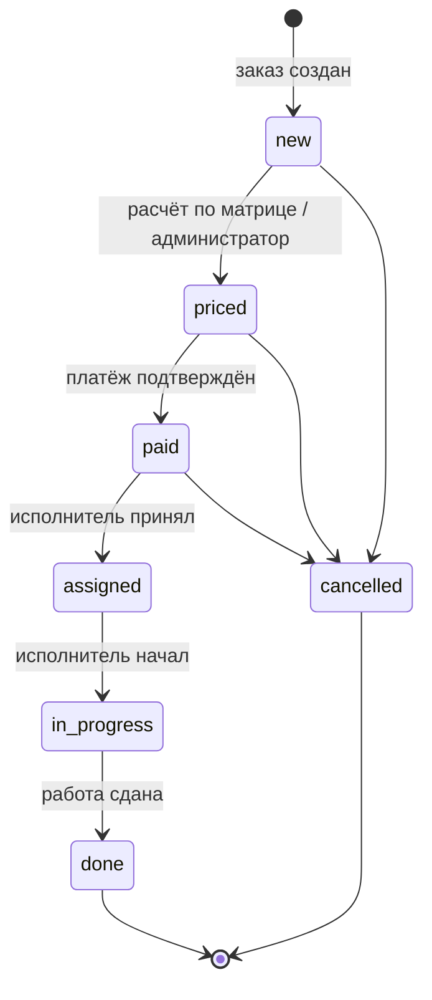

# Процесс обработки заказа: до и после автоматизации

Схемы в нотации, близкой к BPMN (дорожки по ролям, шлюзы, события), нарисованы в Mermaid, чтобы GitHub показывал их без внешних инструментов.

## Как было: 40 минут от обращения до цены

Узкие места: сбор данных занимает 3–6 сообщений с паузами; администратор одновременно ведёт несколько диалогов; поиск и опрос исполнителей вручную.

## Как стало: 17 минут, администратор подключается к готовой карточке

## Статусная модель заказа

## Что изменилось в цифрах

| Показатель | До | После |
|---|---|---|
| Обращение → цена | 40 мин | 17 мин |
| Обращение → оплата (конверсия) | 20 % | 35 % |
| Время администратора на сбор данных | 100 % | −30 % |
| Заявки с полными данными при передаче администратору | ~40 % | > 90 % |
