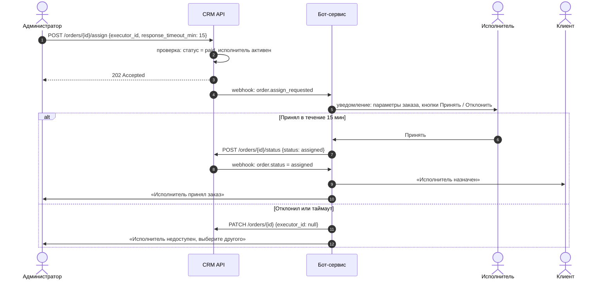

# Sequence-диаграмма: оформление заказа через бота и назначение исполнителя

## Сценарий 1. Создание заказа и расчёт цены

```mermaid
sequenceDiagram
    autonumber
    actor C as Клиент
    participant B as Telegram-бот
    participant CRM as CRM API
    participant P as Прайс-модуль (в CRM)
    actor A as Администратор

    C->>B: /new_order
    loop Шаги диалога (тип, предмет, срок, объём, файлы)
        B->>C: вопрос + кнопки
        C->>B: ответ
        B->>B: валидация; при ошибке — повтор с примером
    end
    B->>C: сводка заказа, «Подтвердить?»
    C->>B: Подтвердить
    B->>CRM: POST /orders {client, work_type, subject, deadline, volume, source: telegram_bot}
    alt CRM ответила 201
        CRM-->>B: 201 {id, status: new}
        B->>CRM: POST /orders/{id}/quote
        alt правило найдено
            CRM->>P: рассчитать по матрице
            P-->>CRM: {min, max}
            CRM-->>B: 200 {min_price, max_price}
            B->>C: «Ориентировочно 2 500–3 500 ₽, администратор подтвердит»
        else правила нет (422)
            CRM-->>B: 422 NEEDS_MANUAL_PRICING
            B->>CRM: PATCH /orders/{id} {needs_manual_pricing: true}
            B->>C: «Цену уточнит администратор в течение 15 минут»
        end
        B->>A: уведомление с карточкой и ссылкой в CRM
    else таймаут 5 с или 5xx
        B->>B: retry ×3 с интервалом 10 с
        alt все попытки неудачны
            B->>B: сохранить черновик локально
            B->>A: «Заявка не создана в CRM, нужна ручная обработка» + данные
            B->>C: «Заявка принята, администратор свяжется с вами»
        end
    end
```

## Сценарий 2. Назначение исполнителя и ответ по таймауту



## Решения, зафиксированные на диаграмме

- **Идемпотентность создания заказа.** Бот передаёт заголовок `Idempotency-Key` = хеш (client.external_id + сводка), чтобы повторы при ретраях не плодили дубли.
- **Кто владеет статусом.** Только CRM меняет статус; бот всегда вызывает API, а не хранит статус локально. Так исключены расхождения между системами.
- **Таймаут на стороне бота, а не CRM.** Бот знает, когда отправил уведомление, и сам отслеживает 15 минут; CRM получает результат одним вызовом.
