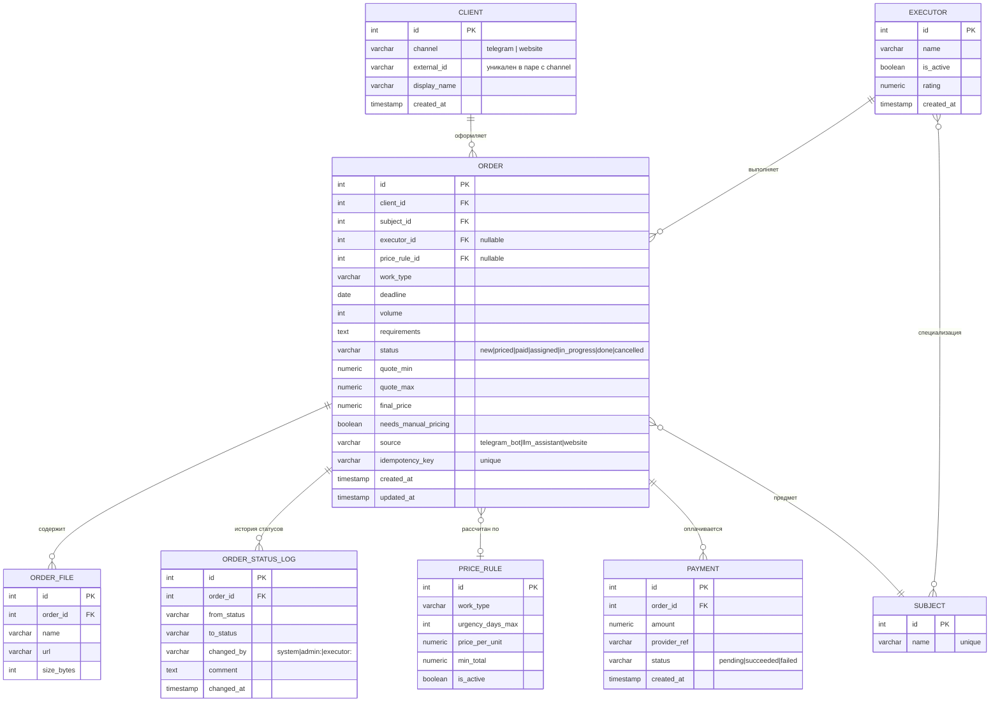

# ER-модель: заказы, клиенты, исполнители, прайс

Модель для PostgreSQL. Показаны сущности, участвующие в процессе приёма и распределения заказов; вспомогательные таблицы (аудит, настройки) опущены.



## Решения по модели

- **`ORDER_STATUS_LOG` вместо полей «дата оплаты», «дата назначения» в заказе.** История переходов даёт время в каждом статусе для отчёта по воронке (US-6) и не требует новых колонок при добавлении статусов.
- **`idempotency_key` в заказе.** Защита от дублей при повторных запросах бота (см. sequence-диаграмму).
- **Клиент идентифицируется парой `channel + external_id`.** Один человек из Telegram и с сайта — два клиента, пока не связаны вручную; это осознанное упрощение на старте.
- **Прайс-правило хранится ссылкой в заказе.** Видно, по какому правилу считали, даже если матрицу потом изменили; сами значения `quote_min/max` тоже фиксируются в заказе.
- **`executor_id` nullable.** Заказ существует до назначения; связь «многие заказы к одному исполнителю» без промежуточной таблицы, потому что у заказа ровно один исполнитель.

## Индексы, которые понадобились под нагрузку отчётов

```sql
CREATE INDEX ix_order_status_created ON "order" (status, created_at);
CREATE INDEX ix_order_executor ON "order" (executor_id) WHERE executor_id IS NOT NULL;
CREATE INDEX ix_status_log_order ON order_status_log (order_id, changed_at);
CREATE UNIQUE INDEX ux_client_channel_ext ON client (channel, external_id);
```

## Пример запроса для отчёта по воронке

```sql
-- среднее время в статусе new и priced за последние 30 дней
SELECT
    l.from_status,
    ROUND(AVG(EXTRACT(EPOCH FROM (l.changed_at - prev.changed_at)) / 60), 1) AS avg_minutes
FROM order_status_log l
JOIN LATERAL (
    SELECT changed_at
    FROM order_status_log p
    WHERE p.order_id = l.order_id AND p.changed_at < l.changed_at
    ORDER BY p.changed_at DESC
    LIMIT 1
) prev ON TRUE
WHERE l.changed_at >= NOW() - INTERVAL '30 days'
  AND l.from_status IN ('new', 'priced')
GROUP BY l.from_status;
```
